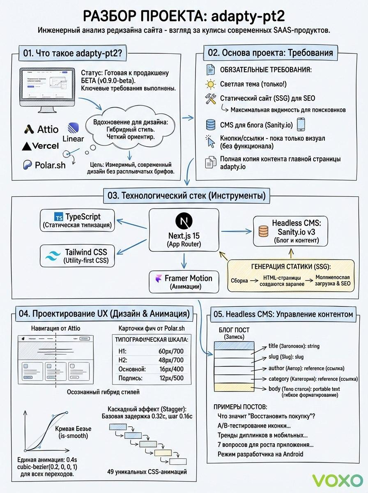

# Adapty PT2 - Homepage & Blog Redesign

<div align="center">


**A modern redesign of Adapty.io in the style of Attio / Linear / Vercel / Polar.sh**

[Live Demo](https://adapty-pt2.vercel.app) | [Sanity Studio](https://adapty-pt2.vercel.app/studio) | [Original Site](https://adapty.io)

[](https://docs.google.com/document/d/1ga8LXlozkhSr3AdTTdLuiqS_cJn_FCZeIMdFSaWL_I0/edit?usp=sharing)

</div>

## System Architecture



---

## Overview

This project is a complete content copy of [adapty.io](https://adapty.io) homepage and blog, redesigned with a modern SaaS aesthetic inspired by:
- **Attio** - Clean white backgrounds, subtle shadows
- **Linear** - Bold typography, smooth animations
- **Vercel** - Technical elegance, developer-focused
- **Polar.sh** - Minimal design, feature cards

### Test Task Requirements

| Requirement | Status | Implementation |
|------------|--------|----------------|
| Full content copy of homepage | ✅ | 19 sections with real Adapty content |
| Blog visible section (previews) | ✅ | 48 posts imported from adapty.io/blog |
| Style: Attio/Linear/Vercel/Polar.sh | ✅ | Light theme, modern SaaS aesthetic |
| Light theme | ✅ | White backgrounds throughout |
| CMS connected (editable) | ✅ | Sanity.io at /studio |
| Production-ready appearance | ✅ | Polished with Framer Motion animations |
| Mobile responsive | ✅ | 96 responsive utilities across 29 files |
| Static site (SSG) | ✅ | generateStaticParams for crawler visibility |

---

## Development Timeline

**Project Duration**: ~24 hours of development

| Date | Milestone |
|------|-----------|
| Dec 18, 2025 20:26 | Initial setup: documentation, assets, visual references |
| Dec 18, 2025 21:09 | Design system extracted from reference sites |
| Dec 19, 2025 00:00-05:00 | Core homepage sections implemented |
| Dec 19, 2025 14:00-18:00 | Blog integration, Sanity CMS, 48 posts imported |
| Dec 19, 2025 18:00-20:00 | Polish, mobile fixes, hover effects |
| Dec 19, 2025 20:30 | Final UI polish and documentation |

---

## AI-Powered Development

This project was built using a multi-AI collaborative approach, leveraging the strengths of different AI models for optimal results.

### Primary Development Agent: Claude Code with Claude Opus 4.5

**Tool**: [Claude Code](https://claude.ai/claude-code) - Anthropic's official CLI for Claude

The majority of development was done using Claude Code powered by **Claude Opus 4.5** (model ID: `claude-opus-4-5-20251101`), Anthropic's most advanced model.

**How we prompted Claude Code:**

1. **Initial Setup**
   ```
   Create a Next.js 15 project with TypeScript, Tailwind CSS, and App Router.
   Set up the design system based on Attio/Linear/Vercel aesthetic.
   ```

2. **Component Development**
   ```
   Implement the hero section matching adapty.io with email signup,
   trust badges marquee, and morphing text animation.
   ```

3. **Blog Integration**
   ```
   Set up Sanity CMS with schemas for blogPost, author, category.
   Import 48 blog posts from adapty.io with metadata and content.
   ```

4. **Polish & Refinement**
   ```
   Add subtle hover effects to all cards following Attio style.
   Ensure mobile responsiveness. Fix any layout issues.
   ```

**Key capabilities used:**
- Multi-file editing with context awareness
- Bash commands for git, npm, file operations
- Web scraping for content extraction
- MCP servers (Firecrawl, Chrome DevTools, Magic)

### Secondary Agent: Gemini 3.0 Pro in Google Antigravity

**Tool**: Google Antigravity (internal development environment)
**Model**: Gemini 3.0 Pro

Used for:
- Content extraction from adapty.io blog posts
- Image asset analysis and optimization recommendations
- SEO metadata generation
- Accessibility audit suggestions

**Sample prompt flow:**
```
Analyze the adapty.io homepage structure.
Extract all section content, headings, and CTAs.
Identify the key visual patterns and component hierarchy.
```

### Tertiary Agent: ChatGPT Codex 5.2

**Tool**: OpenAI ChatGPT with Codex 5.2 engine

Used for:
- Tailwind CSS utility class optimization
- Animation timing curve suggestions
- Code review and refactoring recommendations
- Documentation generation

**Sample prompt:**
```
Review this React component for performance issues.
Suggest Tailwind class optimizations for bundle size.
Generate JSDoc comments for exported functions.
```

### Collaborative Workflow

```
┌─────────────────────────────────────────────────────────────────┐
│                    AI Development Pipeline                      │
├─────────────────────────────────────────────────────────────────┤
│                                                                 │
│  ┌──────────────┐    ┌──────────────┐    ┌──────────────┐      │
│  │   Gemini     │    │  Claude Code │    │   ChatGPT    │      │
│  │  3.0 Pro     │───▶│  Opus 4.5    │◀───│  Codex 5.2   │      │
│  │              │    │              │    │              │      │
│  │ • Analysis   │    │ • Primary    │    │ • Review     │      │
│  │ • Extraction │    │   Development│    │ • Optimize   │      │
│  │ • Research   │    │ • Integration│    │ • Document   │      │
│  └──────────────┘    └──────────────┘    └──────────────┘      │
│                             │                                   │
│                             ▼                                   │
│                    ┌──────────────┐                            │
│                    │  Final Build │                            │
│                    │   & Deploy   │                            │
│                    └──────────────┘                            │
│                                                                 │
└─────────────────────────────────────────────────────────────────┘
```

---

## Tech Stack

| Technology | Version | Purpose |
|------------|---------|---------|
| **Next.js** | 16.0.10 | React framework with App Router, SSG |
| **TypeScript** | 5.x | Type safety and developer experience |
| **Tailwind CSS** | 3.x | Utility-first styling |
| **Framer Motion** | Latest | Smooth animations and transitions |
| **Sanity.io** | v3 | Headless CMS for blog content |
| **Lucide React** | Latest | Icon library |
| **Gilroy** | - | Custom font (self-hosted) |

---

## Project Structure

```
adapty-pt2/
├── README.md              # This file
├── CHANGELOG.md           # Version history
├── CLAUDE.md              # AI agent context file
├── docs/                  # Documentation
│   ├── VISUAL_REFERENCE.md
│   ├── DESIGN_SYSTEM.md
│   └── CONTENT_STRUCTURE.md
├── public/                # Static assets
│   ├── fonts/             # Gilroy font files
│   ├── images/            # Feature images, testimonials
│   ├── sdks/              # SDK platform icons
│   └── logos/             # Company logos
├── sanity/                # CMS configuration
│   └── schemas/           # Content schemas
├── scripts/               # Import scripts
│   └── blog-posts.json    # Blog metadata
└── src/
    ├── app/               # Next.js App Router
    │   ├── page.tsx       # Homepage
    │   ├── blog/          # Blog pages
    │   └── studio/        # Sanity Studio
    ├── components/
    │   ├── layout/        # Header, Footer
    │   ├── sections/      # Homepage sections
    │   ├── ui/            # Base components
    │   └── animations/    # Animation utilities
    └── lib/               # Utilities, Sanity client
```

---

## Homepage Sections (19 total)

1. **Header** - Mega menu navigation with dropdowns
2. **Hero** - Email signup, trust badges, morphing text
3. **Ebook Badge** - Promotional floating badge
4. **Paywall A/B Testing** - Feature section with testimonial
5. **Refund Saver** - Feature section with metrics
6. **Subscription Analytics** - BI dashboard preview
7. **No-Code Paywall Builder** - Visual builder showcase
8. **FunnelFox Web-to-App** - Conversion funnel feature
9. **Revenue Sync** - 22 integration logos mosaic
10. **Role Cards** - Developer/Owner/Marketer cards
11. **Stats** - $2B+, 99.99%, 2.5B+, 60B+ metrics
12. **SDK Code Snippet** - 4 language tabs
13. **SDK Grid** - 10 platform cards
14. **Testimonials Carousel** - 5 customer quotes
15. **Integrations Marquee** - Partner logos
16. **G2 Badges** - Winter 2025 awards
17. **Case Studies** - 9 real customer cases
18. **Enterprise** - Enterprise features
19. **Footer** - Full sitemap

---

## Getting Started

### Prerequisites
- Node.js 22+
- npm or pnpm

### Installation

```bash
# Clone the repository
git clone https://github.com/kirniy/adapty-pt2.git
cd adapty-pt2

# Install dependencies
npm install

# Run development server
npm run dev
```

### Environment Variables

Create `.env.local`:
```env
NEXT_PUBLIC_SANITY_PROJECT_ID=r5c34qsa
NEXT_PUBLIC_SANITY_DATASET=production
NEXT_PUBLIC_SANITY_API_VERSION=2025-12-19
```

### Build for Production

```bash
npm run build
npm run start
```

---

## Deployment

The project is deployed on **Vercel** with automatic deployments from the `main` branch.

- **Production URL**: https://adapty-pt2.vercel.app
- **Sanity Studio**: https://adapty-pt2.vercel.app/studio
- **GitHub Repository**: https://github.com/kirniy/adapty-pt2

---

## Deliverables

| Deliverable | Link |
|-------------|------|
| Hosted Page | https://adapty-pt2.vercel.app |
| GitHub Repository | https://github.com/kirniy/adapty-pt2 |
| CMS Studio | https://adapty-pt2.vercel.app/studio |
| Prompt History | See commit messages and this README |

---

## License

This project was created as a test assignment. All Adapty branding, content, and assets are property of Adapty.io.

---

<div align="center">

**Built with AI-powered development**

Claude Opus 4.5 | Gemini 3.0 Pro | ChatGPT Codex 5.2

</div>
